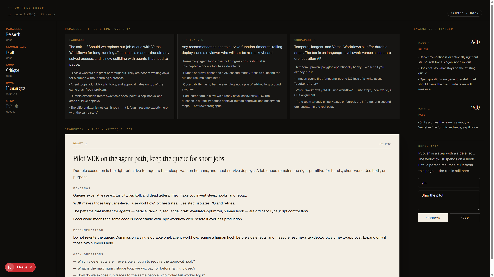

# Durable Brief

A one-page briefing desk that is also a durable workflow.

You commission a topic. The run **fans out research in parallel**, **drafts sequentially**, **critiques and revises in a loop**, then **pauses on a human hook** until someone approves. Close the tab, refresh, even restart the dev server — the run is still waiting, and publish is still a step that has not happened.

Built with the [Workflow SDK](https://workflow-sdk.dev) (`'use workflow'` / `'use step'`), Next.js, and the Vercel AI SDK. No queue to operate. No YAML state machine.

This is the project I would put in front of the [Vercel Workflows](https://vercel.com/careers/software-engineer-workflows-5798416004) team: the patterns in the job post, written as TypeScript control flow.



## Why this exists

A job queue can lease, retry, and dead-letter. PulseQueue already showed that. What it cannot do — without you inventing it — is:

- sleep across a deploy
- wait hours for a person, then resume the same function
- treat `Promise.all`, a `for` loop, and `await hook` as the orchestration API

That is what WDK is for. Durable Brief is a small, visible instance of it.

```
Browser ──POST /api/briefs──► start(briefWorkflow)
   │                              │
   │  GET  /stream (NDJSON)       │  Promise.all  → 3 research steps
   │  POST /approve (resumeHook)  │  await draft
   │                              │  for { critique; maybe revise }
   └──────────────────────────────│  createHook → suspend
                                  │  publish step
```

## The four patterns

All four live in [`workflows/brief.ts`](workflows/brief.ts). That file is the review surface.

| Job-post language | In this repo |
| --- | --- |
| Sequential processing | `writeDraft` awaits the joined research, then `reviseDraft` awaits critique |
| Parallel execution | `Promise.all` of landscape / constraints / comparables steps |
| Evaluator-optimizer | `for` loop: score the draft, revise while `< 8`, cap at 3 passes |
| Pauses, resumptions, state | `createHook` + `resumeHook`; stream chunks survive reconnect |

LLM calls and “publish” are `'use step'` functions, so they retry and show up as discrete spans in `npx workflow web`. The workflow function itself is the orchestrator: no I/O, just control flow.

## Quickstart

Node 22+.

```bash
npm install
npm run dev
```

Open [http://localhost:3000](http://localhost:3000) and commission a brief. With no API key, it runs a **demo world**: canned research and a forced revise-then-pass so you can see the loop. The approval hook is still real — refresh the run page while it says *Paused · hook*.

```bash
# Inspect runs, steps, retries
npm run inspect
```

### Live models

Copy `.env.example` to `.env.local` and set either:

```bash
OPENAI_API_KEY=sk-...
# or
AI_GATEWAY_API_KEY=...
```

Set `DEMO_MODE=0` if you want to force live calls while a key is present. Default model is `gpt-4o-mini`.

## What to look at

1. [`workflows/brief.ts`](workflows/brief.ts) — orchestration. Parallel, loop, hook.
2. [`app/api/briefs/route.ts`](app/api/briefs/route.ts) — `start()` from a route handler.
3. [`app/api/briefs/[runId]/stream/route.ts`](app/api/briefs/[runId]/stream/route.ts) — reconnectable `getReadable({ startIndex })`.
4. [`app/api/briefs/[runId]/approve/route.ts`](app/api/briefs/[runId]/approve/route.ts) — `resumeHook` behind our own route (not a public webhook).
5. [`components/desk.tsx`](components/desk.tsx) — the desk UI, including the paused human gate.

## Deploy

[Vercel](https://vercel.com) is the intended production world. Workflows need no extra config beyond `withWorkflow()` in `next.config.ts`. Set `OPENAI_API_KEY` or `AI_GATEWAY_API_KEY` on the project.

## License

MIT
